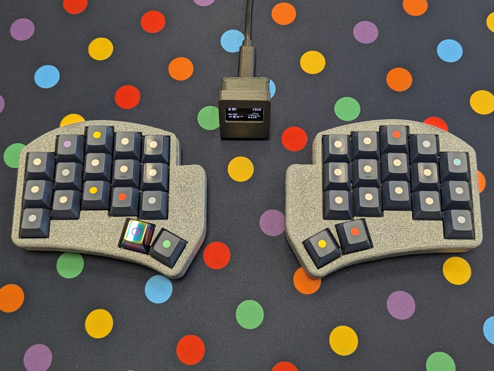

# Cygnus v1 3x5

ZMK configuration for the Cygnus v1 3x5 keyboard with optional dongle display support.

Related repositories:

- [zmk-dongle-display](https://github.com/LukasStu/zmk-dongle-display)
A sleek OLED display to your ZMK dongle for live status updates.

- Cygnus case resources
Minimalistic, great-sounding 3D-printable case with USB access, power switch slider, and reset button for Cygnus-style builds.